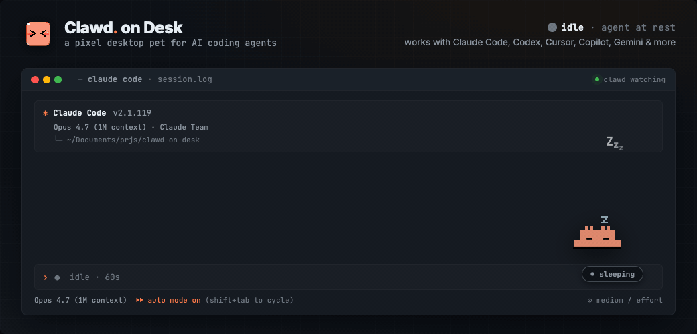
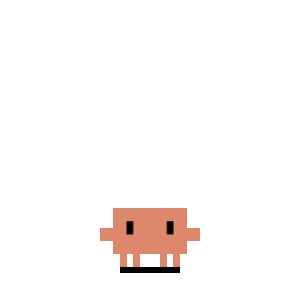
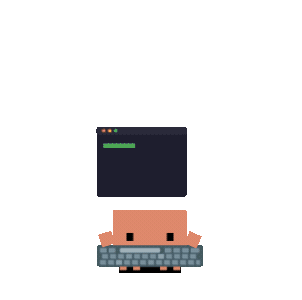
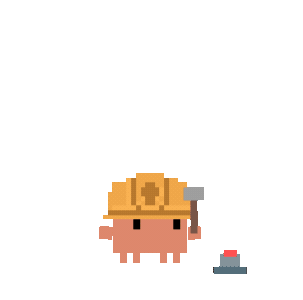
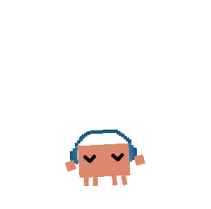
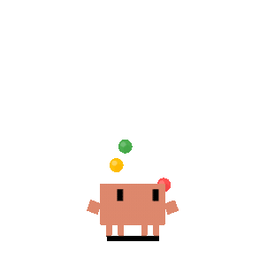
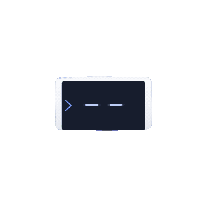
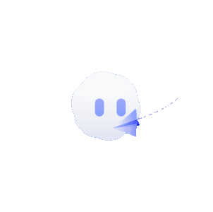

<p align="center">
  
</p>
<h1 align="center">Nibbo</h1>

<p align="center">
  <a href="https://github.com/tusharv2005/Nibbo/releases"></a>
  
  <a href="https://github.com/tusharv2005/Nibbo/stargazers"></a>
  <a href="https://github.com/hesreallyhim/awesome-claude-code"></a>
</p>

<p align="center">
  
</p>

Nibbo is a premium, real-time desktop companion that visualizes what your AI coding agents are doing. Start a long task, walk away, and look back at your screen to see if Nibbo is thinking, working, or celebrating a completed task.

Nibbo features rich, cozy visuals and real-time state animations—thinking when your agent is prompted, typing when it executes tools, grooving or juggling for subagents, prompting you with custom desktop permission bubbles, and falling asleep when the desk is quiet. 

It comes with four built-in themes: **Clawd** (pixel crab), **Calico** (cozy tortoiseshell cat), **Cloudling** (fluffy cloud), and **Dewdrop** (green slime sprout), with full support for custom themes and imported Codex Pet animation packs.

> Works with **Claude Code**, **Codex CLI**, **Copilot CLI**, **Gemini CLI**, **Antigravity CLI (agy)**, **Cursor Agent**, **CodeBuddy**, **Kiro CLI**, **Kimi Code CLI (Kimi-CLI)**, **Qwen Code**, **opencode**, **Pi**, **OpenClaw**, and **Hermes Agent**. Fully compatible with Windows 11, macOS, and Ubuntu/Linux.

---

## Key Features

### 🔌 Multi-Agent Integrations
- **Claude Code** — Seamless integration via native command hooks and custom HTTP permission hooks.
- **Codex CLI** — Official hook system with JSONL fallback (`~/.codex/sessions/`), registered automatically with custom permission bubbles.
- **Copilot CLI** — Command hooks integrated via `~/.copilot/hooks/hooks.json`.
- **Gemini CLI** — Command hooks via `~/.gemini/settings.json` (auto-registered, or run `npm run install:gemini-hooks`).
- **Antigravity CLI (agy)** — Integrated via `~/.gemini/config/hooks.json` (auto-registered, or run `npm run install:antigravity-hooks`). Note: State-only integration; all Allow/Deny decisions remain inside agy's native terminal menu.
- **Cursor Agent** — [Cursor IDE hooks](https://cursor.com/docs/agent/hooks) in `~/.cursor/hooks.json` (auto-registered, or run `npm run install:cursor-hooks`).
- **CodeBuddy** — Claude Code-compatible command and HTTP permission hooks via `~/.codebuddy/settings.json` (auto-registered, or run `node hooks/codebuddy-install.js`).
- **Kiro CLI** — Command hooks injected into agent configurations under `~/.kiro/agents/`, plus an auto-created `nibbo` agent synced from Kiro's default config.
- **Kimi Code CLI (Kimi-CLI)** — Command hooks configured via `~/.kimi/config.toml` (`[[hooks]]` entries) (auto-registered, or run `npm run install:kimi-hooks`).
- **Qwen Code** — Command hooks via `~/.qwen/settings.json` (auto-registered, or run `npm run install:qwen-hooks`), supporting state tracking and desktop approval bubbles.
- **opencode** — [Plugin integration](https://opencode.ai/docs/plugins) via `~/.config/opencode/opencode.json` (auto-registered) with zero-latency event streaming and permission bubbles.
- **Pi** — Global extension via `~/.pi/agent/extensions/nibbo` (auto-registered, or run `npm run install:pi-extension`).
- **OpenClaw** — State-only plugin integration via `~/.openclaw/openclaw.json` (auto-registered when OpenClaw config exists).
- **Hermes Agent** — [Plugin integration](https://hermes-agent.org/) via the managed plugin directory (auto-registered, or run `npm run install:hermes-plugin`).
- **Coexistence Mode** — Run multiple agents simultaneously; Nibbo monitors and aggregates session state priorities seamlessly.

### 🎭 Animations & Customization
- **12 Animated States** — Idle, thinking, typing, building, subagent groove, multi-subagent juggling, error, happy, notification, sweeping, carrying, and sleeping.
- **Eye Tracking & Physics** — Nibbo's eyes track your cursor in the idle state, accompanied by a dynamic body lean and shadow stretch.
- **Sleep Sequence** — Cycles through yawning, dozing, collapsing, and sleeping after 60s of inactivity; wakes up with a startled wake-up animation upon mouse movement.
- **Click & Interaction Physics** — Double-click to poke the pet, click four times for a flail reaction, and drag-and-drop from any state with pointer capture.
- **Mini Mode** — Drag Nibbo to the right screen edge or right-click to enter Mini Mode. The pet tucks away at the screen border, peeking on hover and executing parabolic jump transitions.
- **Codex Pet Imports** — Easily import Codex Pet zip packages from `Settings` → `Theme`. Nibbo dynamically maps their atlas animations into managed themes.

### 🛡️ Smart Desktop Permission Bubbles
- **Interactive Prompts** — When supported agents request file edits or command executions, Nibbo displays a floating bubble card on your desktop so you don't have to watch the terminal.
- **Quick Actions** — Approve, deny, or configure permanent rules (`Always`) in a single click.
- **Keyboard Shortcuts** — Use `Ctrl+Shift+Y` to Allow and `Ctrl+Shift+N` to Deny active permission bubbles.
- **Smart Stacking & Sync** — Prompts stack cleanly upward from the bottom-right corner and dismiss automatically if answered inside the terminal first.

### 📊 Session Dashboard & HUD
- **Real-Time Monitoring** — Open the Sessions History Dashboard to view active sessions, past tool runs, logs, and system commands.
- **Session HUD** — A glassmorphic overlay containing current session states, times elapsed, and subagent processes.
- **Terminal Focus** — Click on any session in the HUD or Dashboard to instantly focus that agent's terminal window.

### ⚙️ System Features
- **Click-Through Transparency** — Transparent window areas pass clicks straight to the workspace below; only the pet's body registers inputs.
- **Auto-Start & Memory** — Nibbo remembers its coordinates across restarts and can launch automatically when a supported agent session starts.
- **Do Not Disturb (DND)** — Silences sound effects and suppresses permission bubbles (allowing agents to fall back to their native terminal prompts).
- **Sound Design** — Subtle audio alerts for task completions and permission cues (includes a 10s cooldown and auto-mute in DND).

---

## Animations

<table>
  <tr>
    <td align="center"><br><sub>Clawd Idle</sub></td>
    <td align="center"><br><sub>Clawd Thinking</sub></td>
    <td align="center"><br><sub>Clawd Typing</sub></td>
    <td align="center"><br><sub>Clawd Building</sub></td>
    <td align="center"><br><sub>Clawd 1 Subagent</sub></td>
    <td align="center"><br><sub>Clawd 2+ Subagents</sub></td>
  </tr>
  <tr>
    <td align="center"><br><sub>Calico Idle</sub></td>
    <td align="center"><br><sub>Calico Thinking</sub></td>
    <td align="center"><br><sub>Calico Typing</sub></td>
    <td align="center"><br><sub>Calico Building</sub></td>
    <td align="center"><br><sub>Calico Juggling</sub></td>
    <td align="center"><br><sub>Calico Conducting</sub></td>
  </tr>
  <tr>
    <td align="center"><br><sub>Cloudling Idle</sub></td>
    <td align="center"><br><sub>Cloudling Thinking</sub></td>
    <td align="center"><br><sub>Cloudling Typing</sub></td>
    <td align="center"><br><sub>Cloudling Building</sub></td>
    <td align="center"><br><sub>Cloudling Juggling</sub></td>
    <td align="center"><br><sub>Cloudling Conducting</sub></td>
  </tr>
  <tr>
    <td align="center"><br><sub>Dewdrop Idle</sub></td>
    <td align="center"><br><sub>Dewdrop Thinking</sub></td>
    <td align="center"><br><sub>Dewdrop Typing</sub></td>
    <td align="center"><br><sub>Dewdrop Building</sub></td>
    <td align="center"><br><sub>Dewdrop Groove</sub></td>
    <td align="center"><br><sub>Dewdrop Alert</sub></td>
  </tr>
</table>

For the full state mapping guides and interaction physics, see **[docs/guides/state-mapping.md](docs/guides/state-mapping.md)**.

---

## Quick Start

Download the latest prebuilt installer from **[GitHub Releases](https://github.com/tusharv2005/Nibbo/releases/latest)**:

- **Windows**: `Nibbo-Setup-<version>-x64.exe` or `Nibbo-Setup-<version>-arm64.exe`
- **macOS**: `.dmg` (supports Apple Silicon and Intel)
- **Linux**: `.AppImage` or `.deb`

Launch Nibbo after installation; active agent hooks are configured automatically.

### Running from Source
Run from source to test unreleased integrations or contribute to the project:

```bash
# Clone the repository
git clone https://github.com/tusharv2005/Nibbo.git
cd Nibbo

# Install Node.js dependencies
npm install

# Start the Nibbo Electron application
npm start
```

For advanced setups including Remote SSH servers, Windows Subsystem for Linux (WSL), and platform-specific guides, see **[docs/guides/setup-guide.md](docs/guides/setup-guide.md)** and **[docs/guides/guide-remote-ssh.md](docs/guides/guide-remote-ssh.md)**.

---

## Creating Custom Themes

Nibbo supports custom pet formats. You can create your own character or import packages from **Codex Pet**:
1. Open `Settings` → `Theme` → `Import pet zip` and select any Codex Pet package.
2. To scaffold a theme from scratch, run:
   ```bash
   npm run create-theme -- my-custom-theme
   ```
3. Edit `theme.json` and add your assets (supports SVGs, GIFs, WebPs, APNGs, and PNGs).
4. For detailed field mappings, read the **[docs/guides/guide-theme-creation.md](docs/guides/guide-theme-creation.md)**.

---

## Contributing

Nibbo is community-driven. Bug reports, feature suggestions, and pull requests are highly appreciated. Feel free to open an [issue](https://github.com/tusharv2005/Nibbo/issues) or submit a PR.

### Maintainers & Contributors

<table>
  <tr>
    <td align="center" valign="top" width="140"><a href="https://github.com/tusharv2005"><br /><sub><b>@tusharv2005</b><br />Developer / Creator</sub></a></td>
  </tr>
</table>

---

## License

Source code is licensed under the [GNU Affero General Public License v3.0](LICENSE) (AGPL-3.0).

**Artwork and bundled theme assets (inside `assets/` and `themes/*/assets/`) are not covered by AGPL-3.0.** All rights reserved by the original creators. See [assets/LICENSE](assets/LICENSE) for details.
- **Clawd** theme artwork inspired by Anthropic.
- **Calico** and **Cloudling** artwork by 鹿鹿 ([@rullerzhou-afk](https://github.com/rullerzhou-afk)).
- **Dewdrop** theme assets.
